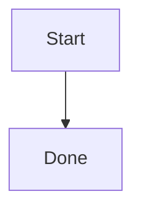

# @mohtasham/md-to-docx

> Convert Markdown to Microsoft Word (`.docx`) documents — in Node.js, in the browser, or straight from your terminal.

[npm version](https://www.npmjs.com/package/@mohtasham/md-to-docx)
[npm downloads](https://www.npmjs.com/package/@mohtasham/md-to-docx)
[license](./LICENSE)
[types](https://www.npmjs.com/package/@mohtasham/md-to-docx)
[node](https://nodejs.org)

A TypeScript-first library and CLI that turns Markdown into production-ready Word documents: headings, tables, lists, footnotes, images, code blocks with optional syntax highlighting, multi-section templates, per-section headers/footers, page numbering, TOC, and fine-grained style control.

---

## Table of contents

- [Highlights](#highlights)
- [Installation](#installation)
- [Quick start](#quick-start)
- [CLI](#cli)
- [Programmatic usage](#programmatic-usage)
  - [Browser](#browser)
  - [Node.js](#nodejs)
  - [React](#react)
- [Features](#features)
  - [Multi-section documents (template + sections)](#multi-section-documents-template--sections)
  - [Syntax-highlighted code blocks](#syntax-highlighted-code-blocks)
  - [Math rendering](#math-rendering)
  - [Custom heading and paragraph alignment](#custom-heading-and-paragraph-alignment)
  - [Table of Contents styling](#table-of-contents-styling)
  - [Text find-and-replace](#text-find-and-replace)
  - [Server-side processing limits](#server-side-processing-limits)
  - [RTL / bidirectional text](#rtl--bidirectional-text)
  - [Reference DOCX placeholder patching](#reference-docx-placeholder-patching)
- [Supported Markdown](#supported-markdown)
- [API reference](#api-reference)
- [Requirements](#requirements)
- [Install as an agent skill](#install-as-an-agent-skill)
- [Development](#development)
- [Changelog](#changelog)
- [Contributing](#contributing)
- [License](#license)

---

## Highlights

- **Zero-config defaults** — pass any Markdown string, get a valid `.docx` Blob back.
- **First-class CLI** — `npx @mohtasham/md-to-docx input.md output.docx`.
- **TypeScript-native** — fully typed options surface, including `CodeHighlightTheme`, `Options`, and `DocumentSection`.
- **Multi-section documents** — cover pages, per-section headers/footers, page numbering resets, mixed orientations, style overrides.
- **Reference DOCX patching** — Node-friendly placeholder replacement for inserting generated Markdown into an existing `.docx` package.
- **Optional syntax highlighting** — opt-in, powered by `[lowlight](https://github.com/wooorm/lowlight)`; ships a GitHub-light theme and lets you override any token color.
- **Native Word math** — Markdown `$...$` and `$$...$$` equations render as editable Word math for a documented TeX subset.
- **Works everywhere** — Node.js (18+) and modern browsers; the package ships ESM with type declarations.
- **Small public surface, stable API** — only the root entrypoint is exported via `package.json#exports`.

## Installation

```bash
npm install @mohtasham/md-to-docx
# or
pnpm add @mohtasham/md-to-docx
# or
yarn add @mohtasham/md-to-docx
```

## Quick start

```typescript
import { convertMarkdownToDocx } from "@mohtasham/md-to-docx";
import fs from "node:fs/promises";

const markdown = `
# Hello, Word

This document was generated from **Markdown** in TypeScript.

- Supports lists
- **Bold**, *italic*, ++underline++, ~~strikethrough~~
- Tables, blockquotes, GitHub-style callouts, images, and code blocks

\`\`\`ts
const greet = (name: string) => \`Hello, \${name}!\`;
\`\`\`
`;

const blob = await convertMarkdownToDocx(markdown);
await fs.writeFile("hello.docx", Buffer.from(await blob.arrayBuffer()));
```

## CLI

Convert files without writing any code:

```bash
# Run without installing
npx @mohtasham/md-to-docx input.md output.docx

# Or install globally
npm install -g @mohtasham/md-to-docx
md-to-docx input.md output.docx

# Apply styling or multi-section config from a JSON file
md-to-docx input.md output.docx --options options.json
md-to-docx input.md output.docx -o options.json

# Help
md-to-docx --help
```

The `--options` JSON file accepts the same shape as the programmatic `Options` argument. Example:

```json
{
  "documentType": "report",
  "style": {
    "fontFamily": "Trebuchet MS",
    "heading1Alignment": "CENTER",
    "paragraphAlignment": "JUSTIFIED"
  },
  "codeHighlighting": { "enabled": true }
}
```

For a multi-section document, use `template` + `sections` (the CLI ignores the positional markdown argument when `sections` is provided):

```json
{
  "template": {
    "pageNumbering": { "display": "current", "alignment": "CENTER" }
  },
  "sections": [
    {
      "markdown": "# Cover\n\nPrepared for ACME",
      "footers": { "default": null },
      "pageNumbering": { "display": "none" }
    },
    {
      "markdown": "[TOC]\n\n# Body\n\nMain content…",
      "headers": { "default": { "text": "Main Section", "alignment": "RIGHT" } },
      "pageNumbering": { "start": 1, "formatType": "decimal" }
    }
  ]
}
```

## Programmatic usage

### Browser

```typescript
import { convertMarkdownToDocx, downloadDocx } from "@mohtasham/md-to-docx";

const blob = await convertMarkdownToDocx("# Hello\n\nWorld.");
downloadDocx(blob, "hello.docx");
```

### Node.js

```typescript
import { convertMarkdownToBuffer } from "@mohtasham/md-to-docx";
import fs from "node:fs/promises";

const buffer = await convertMarkdownToBuffer(await fs.readFile("input.md", "utf8"));
await fs.writeFile("output.docx", buffer);
```

### React

```tsx
import { useState } from "react";
import { convertMarkdownToDocx, downloadDocx } from "@mohtasham/md-to-docx";

export function MarkdownExporter() {
  const [markdown, setMarkdown] = useState("");

  const exportDocx = async () => {
    const blob = await convertMarkdownToDocx(markdown);
    downloadDocx(blob, "export.docx");
  };

  return (
    <>
      <textarea value={markdown} onChange={(e) => setMarkdown(e.target.value)} />
      <button onClick={exportDocx}>Export as DOCX</button>
    </>
  );
}
```

## Features

### Multi-section documents (template + sections)

Use `template` for shared section defaults and `sections` for explicit parts with their own markdown, headers, footers, page numbering, orientation, and style overrides.

```typescript
const blob = await convertMarkdownToDocx("", {
  style: { fontFamily: "Trebuchet MS", paragraphSize: 24 },
  template: {
    page: {
      margin: { top: 1440, right: 1080, bottom: 1440, left: 1080 },
    },
    pageNumbering: { display: "current", alignment: "CENTER" },
  },
  sections: [
    {
      markdown: "# My Report\n\nPrepared for ACME",
      footers: { default: null },
      pageNumbering: { display: "none" },
      style: { paragraphAlignment: "CENTER", paragraphSize: 28 },
    },
    {
      markdown: "[TOC]\n\n# Executive Summary\n\n…",
      titlePage: true,
      type: "NEXT_PAGE",
      headers: {
        default: { text: "Executive Summary", alignment: "RIGHT" },
        first: { text: "Executive Summary (First)", alignment: "RIGHT" },
      },
      footers: {
        default: {
          text: "Page",
          pageNumberDisplay: "currentAndSectionTotal",
          alignment: "RIGHT",
        },
      },
      pageNumbering: { start: 1, formatType: "decimal" },
      style: { paragraphAlignment: "JUSTIFIED" },
    },
    {
      markdown: "# Appendix\n\n…",
      type: "ODD_PAGE",
      page: { size: { orientation: "LANDSCAPE" } },
      pageNumbering: { start: 1, formatType: "upperRoman" },
      style: { paragraphSize: 22 },
    },
  ],
});
```

**Precedence (last wins):** global `style` → `template.style` → per-section `style`. For `headers` / `footers`, each slot (`default`, `first`, `even`) can inherit, override, or be explicitly disabled with `null`.

### Reference DOCX placeholder patching

Use `patchMarkdownInDocxToBuffer` when you already have a Word template and want Markdown inserted at named placeholders. This workflow preserves the original DOCX package around the patched location, including existing styles, headers, footers, margins, cover pages, and static content.

Create placeholders in the reference DOCX as plain text, for example `{{body}}`, then patch them from Node:

```typescript
import { patchMarkdownInDocxToBuffer } from "@mohtasham/md-to-docx";
import fs from "node:fs/promises";

const template = await fs.readFile("corporate-template.docx");
const output = await patchMarkdownInDocxToBuffer(
  template,
  {
    body: `# Quarterly Update

Hello **team**.

| Metric | Value |
| --- | --- |
| Revenue | $1.2M |`,
  },
  {
    style: { fontFamily: "Aptos" },
    keepOriginalStyles: true,
    tableWidthTwips: 9746,
  }
);

await fs.writeFile("report.docx", output);
```

The default placeholder delimiters are `{{` and `}}`. Use `placeholderDelimiters` if your template uses a different marker:

```typescript
await patchMarkdownInDocxToBuffer(template, patches, {
  placeholderDelimiters: { start: "[[", end: "]]" },
});
```

Supported in this first mode:

- Node-first `.docx` patching from an existing DOCX buffer.
- Document-level placeholder replacement with generated paragraphs, headings, tables, blockquotes, code blocks, links, images, bullet lists, and page breaks.
- Preserving existing package parts that are not replaced by the placeholder patch.
- Configurable markdown table width through `tableWidthTwips` when the reference template uses non-default margins or page geometry.

Current limitations:

- This is not a "reference styles" mode for generating a brand-new DOCX from another DOCX.
- This does not append to the end of a document unless the template contains a placeholder at that location.
- Markdown table width is not inferred from the reference DOCX. Set `tableWidthTwips` to match the placeholder section's content width when the template differs from the default A4 portrait width.
- Ordered lists, generated `[TOC]`, and Word comments are rejected in patch markdown because they require package-level merges that are not supported yet.
- Browser use may work when you provide DOCX bytes, but this workflow is designed and tested for Node.

### Syntax-highlighted code blocks

Highlighting is **opt-in**; when disabled (the default) output is byte-identical to pre-highlighting versions. When enabled, each token becomes its own colored `TextRun`.

```typescript
await convertMarkdownToDocx(markdown, {
  codeHighlighting: {
    enabled: true,
    showLanguageLabel: true,
    languages: ["typescript", "javascript", "python", "bash"],
    theme: {
      background: "0D1117",
      border: "30363D",
      default: "C9D1D9",
      languageLabel: "8B949E",
      keyword: "FF7B72",
      string: "A5D6FF",
      number: "79C0FF",
      comment: "8B949E",
      "title.function": "D2A8FF",
    },
  },
});
```

Theme keys map 1:1 to `hljs-*` token classes (without the `hljs-` prefix); values are RRGGBB hex strings without `#`. Reserved keys: `default`, `background`, `border`, `languageLabel`. Unknown or non-whitelisted languages fall back to the plain rendering path, so conversion never throws on an unsupported fence.

### Math rendering

Markdown math is enabled by default. Inline math uses single-dollar delimiters, and block math uses `$$` fences on their own lines:

```markdown
Inline math: $x^2 + y_1$

$$
\frac{1}{2} + \sqrt{x}
$$
```

The renderer emits native Word math objects, not images, so supported equations remain editable in Word. The first supported subset covers plain symbols and text, superscript/subscript, combined subscript/superscript, `\frac{...}{...}`, `\sqrt{...}`, common Greek-letter commands, common operators such as `\times`, `\cdot`, `\le`, `\ge`, `\neq`, `\approx`, `\sum`, and `\int`, plus simple function names such as `\sin`, `\cos`, `\tan`, `\log`, and `\ln`.

Unsupported TeX falls back to literal source text by default, including delimiters, so content is not silently dropped. To fail conversion instead, set:

```typescript
await convertMarkdownToDocx(markdown, {
  mathRendering: { unsupported: "throw" },
});
```

To keep dollar-delimited text literal and skip math parsing entirely:

```typescript
await convertMarkdownToDocx(markdown, {
  mathRendering: { enabled: false },
});
```

Escaped dollars such as `\$x^2$` remain text. Advanced TeX layout commands such as matrices, over/under accents, custom macros, and root-degree syntax are not rendered as equations in this native subset.

### Mermaid diagram blocks

Mermaid rendering is **opt-in** and requires a programmatic renderer callback. The package does not bundle Mermaid, Chromium, Playwright, a CLI runner, or any other diagram runtime, so converting untrusted Markdown cannot execute diagram tooling by default.

When disabled (the default), Mermaid fences render exactly like ordinary code blocks:

````markdown

````

To embed Mermaid diagrams as DOCX images, provide a callback that returns PNG, JPEG, or GIF bytes:

```typescript
await convertMarkdownToDocx(markdown, {
  mermaidRendering: {
    enabled: true,
    render: async ({ code, signal }) => {
      const pngBytes = await renderMermaidToPng(code, { signal });
      return {
        data: pngBytes,
        contentType: "image/png",
        width: 640,
      };
    },
  },
});
```

Rendered diagrams use the same image sizing and `imageHandling.maxImages` / `maxImageBytes` limits as normal embedded images. If rendering is unavailable or fails, the default `failureMode` is `"codeBlock"` so the original Mermaid source remains in the document. Set `failureMode: "placeholder"` to emit a visible failure paragraph, or `"throw"` to fail conversion with `MarkdownConversionError`.

Security note: run Mermaid or browser-based renderers with the same care as any server-side rendering pipeline for untrusted input. Use request timeouts, `AbortSignal`, process isolation or sandboxing, memory limits, and a vetted Mermaid configuration. The CLI options JSON cannot provide a renderer function, so CLI-only usage preserves Mermaid fences as code unless wrapped by a host application.

### Custom heading and paragraph alignment

Each heading level and block type can be aligned independently:

```typescript
await convertMarkdownToDocx(markdown, {
  style: {
    heading1Alignment: "CENTER",
    heading2Alignment: "RIGHT",
    heading3Alignment: "JUSTIFIED",
    paragraphAlignment: "JUSTIFIED",
    blockquoteAlignment: "CENTER",
  },
});
```

Set `headingAlignment` to provide a fallback for any level without its own override.

### GitHub-style callouts

GitHub-style blockquote callouts render as styled DOCX callout blocks:

```markdown
> [!NOTE]
> Use callouts for supporting information with **inline formatting**.
>
> Additional quoted paragraphs stay inside the callout.

> [!WARNING]
> Warning content renders with warning styling.
```

Supported callout markers are `NOTE`, `TIP`, `IMPORTANT`, `WARNING`, and `CAUTION`.
Unsupported markers, such as `> [!INFO]`, are rendered as ordinary blockquotes with the marker text preserved. Container-directive syntax such as `:::note` is not parsed and falls back to normal Markdown text.

Callout colors can be customized per type:

```typescript
await convertMarkdownToDocx(markdown, {
  style: {
    calloutStyles: {
      warning: {
        borderColor: "B45309",
        backgroundColor: "FFF7ED",
        titleColor: "92400E",
      },
    },
  },
});
```

### Table of Contents styling

Drop `[TOC]` on its own line in your markdown to render a clickable, auto-populated table of contents. Every TOC level is individually styleable:

```typescript
await convertMarkdownToDocx(markdown, {
  toc: {
    title: "Contents",
    minDepth: 1,
    maxDepth: 3,
  },
  style: {
    tocFontSize: 22,
    tocHeading1FontSize: 28, tocHeading1Bold: true,
    tocHeading2FontSize: 24, tocHeading2Bold: true,
    tocHeading3FontSize: 22,
    tocHeading4FontSize: 20, tocHeading4Italic: true,
    tocHeading5FontSize: 18, tocHeading5Italic: true,
  },
});
```

### Text find-and-replace

Run string, regex, or trusted functional replacements over the Markdown AST before conversion — they apply across every element type (headings, paragraphs, list items, table cells, etc.):

```typescript
await convertMarkdownToDocx(markdown, {
  textReplacements: [
    { find: /oldText/g, replace: "newText" },
    { find: "Company Name", replace: "Acme Corp" },
    { find: /(\d+)/g, replace: (match) => `Number: ${match}` },
  ],
});
```

Function replacements execute JavaScript in the conversion process and must only be constructed by trusted programmatic callers. They are still supported by default for backward compatibility.

For untrusted input, set `textReplacementMode: "untrusted"` and prefer literal string replacements. In untrusted mode, function replacements are rejected before conversion. Regex replacements are accepted only when they fit bounded safety checks; patterns with nested quantifiers or excessive length are rejected before conversion to avoid ReDoS-style stalls.

Escaped link syntax such as `\[label](https://example.com)` stays plain text in the DOCX. Hyperlinks are emitted only from actual Markdown link nodes.

### Server-side processing limits

Limits are opt-in so existing large-document workflows keep working. For API endpoints, upload forms, webhooks, or any untrusted input, set both input and parsed-structure caps and use `AbortSignal` for request cancellation or timeouts:

```typescript
const controller = new AbortController();
const timeout = setTimeout(() => controller.abort(), 10_000);

try {
  const blob = await convertMarkdownToDocx(markdown, {
    maxInputLength: 1_048_576,
    maxElements: 50_000,
    textReplacementMode: "untrusted",
    signal: controller.signal,
    imageHandling: {
      remote: { enabled: false },
      maxImages: 25,
    },
  });
} finally {
  clearTimeout(timeout);
}
```

`maxInputLength` is measured with JavaScript string length. When `sections` is provided, all section markdown lengths are summed. `maxElements` counts parsed Markdown AST nodes across every section after `textReplacements` run. The CLI options JSON can set numeric limits, but `signal` is programmatic-only.

### RTL / bidirectional text

```typescript
await convertMarkdownToDocx(markdown, {
  style: {
    direction: "RTL",
    paragraphAlignment: "RIGHT",
  },
});
```

## Supported Markdown


| Feature           | Syntax                         | Notes                                                |
| ----------------- | ------------------------------ | ---------------------------------------------------- |
| Headings          | `# ... ######`                 | H1-H6, individually styleable                        |
| Bold / italic     | `**bold**`, `*italic*`         |                                                      |
| Underline         | `++underline++`                | Custom marker                                        |
| Strikethrough     | `~~text~~`                     | GFM                                                  |
| Inline code       | `` `code` ``                   |                                                      |
| Code blocks       | ````` fenced                   | Optional syntax highlighting per block               |
| Math              | `$x^2$`, `$$...$$`             | Native Word math subset; literal fallback            |
| Lists             | `-`, `*`, `1.`                 | Bullet, numbered, nested, rich formatting inside     |
| Tables            | `\| a \| b \|`                 | GFM tables                                           |
| Blockquotes       | `> text`                       |                                                      |
| Callouts          | `> [!NOTE]`                    | GitHub-style NOTE/TIP/IMPORTANT/WARNING/CAUTION      |
| Links             | `[text](url)`                  |                                                      |
| Images            | ``                  | HTTP(S) and `data:` URLs; supports `#w=...&h=...` sizing |
| Footnotes         | `Text[^1]` + `[^1]: Note text` | Native Word footnotes                                |
| Horizontal rule   | `---`                          | Skipped during conversion                            |
| Table of Contents | `[TOC]`                        | Clickable, auto-populated                            |
| Page break        | `\pagebreak`                   | Place on its own line                                |
| Comments          | `<!-- COMMENT: text -->`       | Rendered as Word comments                            |

Markdown footnotes use the GFM/remark syntax:

```markdown
Text with a note[^1].

[^1]: Footnote text with **formatting**, [links](https://example.com), and `code`.
```

Referenced definitions are emitted to `word/footnotes.xml` as native Word footnotes. Inline formatting, safe links, inline code, lists, blockquotes, images, and code blocks in footnote bodies are rendered where the DOCX footnote model supports them. Tables inside footnote definitions are flattened to plain ` | `-separated text rows, and nested footnote references inside footnote bodies are kept as literal `[^id]` text. Unresolved references are also kept as literal text so they remain visible in the output.

## API reference

### `convertMarkdownToDocx(markdown, options?): Promise<Blob>`

Converts Markdown text (or a multi-section template) to a DOCX Blob.


| Argument   | Type       | Description                                                 |
| ---------- | ---------- | ----------------------------------------------------------- |
| `markdown` | `string`   | Markdown source. Ignored if `options.sections` is provided. |
| `options`  | `Options?` | See below.                                                  |


### `convertMarkdownToArrayBuffer(markdown, options?): Promise<ArrayBuffer>`

Converts Markdown text to DOCX bytes in any runtime with `ArrayBuffer` support.

### `convertMarkdownToBuffer(markdown, options?): Promise<Buffer>`

Node-friendly helper for writing DOCX output to disk, object storage, or HTTP responses.

### `patchMarkdownInDocx(referenceDocx, patches, options?): Promise<Blob>`

Patches generated Markdown into an existing DOCX at named placeholders such as `{{body}}`.

### `patchMarkdownInDocxToArrayBuffer(referenceDocx, patches, options?): Promise<ArrayBuffer>`

Patches a reference DOCX and returns bytes in any runtime with `ArrayBuffer` support.

### `patchMarkdownInDocxToBuffer(referenceDocx, patches, options?): Promise<Buffer>`

Node-friendly helper for writing a patched reference DOCX to disk, object storage, or HTTP responses.

### `downloadDocx(blob, filename?): Promise<void>`

Browser-only async helper that triggers a file download. Throws in non-browser environments. `filename` defaults to `"document.docx"`.

### `Options`

```typescript
interface Options {
  documentType?: "document" | "report";
  style?: Style;
  toc?: TocOptions;
  mathRendering?: MathRenderingOptions;
  maxInputLength?: number;
  maxElements?: number;
  signal?: AbortSignal;
  template?: DocumentSection;
  sections?: DocumentSection[];
  codeHighlighting?: CodeHighlightOptions;
  mermaidRendering?: MermaidRenderingOptions;
  textReplacements?: TextReplacement[];
  textReplacementMode?: "trusted" | "untrusted";
  imageHandling?: ImageHandlingOptions;
}
```

### `PatchMarkdownOptions`

```typescript
type MarkdownDocxPatch =
  | string
  | {
      markdown: string;
      style?: Partial<Style>;
    };

interface PatchMarkdownOptions {
  documentType?: "document" | "report";
  style?: Partial<Style>;
  codeHighlighting?: CodeHighlightOptions;
  textReplacements?: TextReplacement[];
  imageHandling?: ImageHandlingOptions;
  maxInputLength?: number;
  maxElements?: number;
  signal?: AbortSignal;
  keepOriginalStyles?: boolean;
  placeholderDelimiters?: { start: string; end: string };
  recursive?: boolean;
  tableWidthTwips?: number;
}
```

`patches` is an object keyed by placeholder name without delimiters. With the default delimiters, `{ body: "# Report" }` replaces `{{body}}` in the reference DOCX.

#### `Style`

Text sizes


| Option                                        | Type                  | Description                              |
| --------------------------------------------- | --------------------- | ---------------------------------------- |
| `fontFamily`                                  | `string`              | Base font family                         |
| `fontFamilly`                                 | `string` (deprecated) | Alias for `fontFamily`                   |
| `titleSize`                                   | `number`              | Title size (half-points)                 |
| `heading1Size` … `heading6Size`               | `number`              | Per-level heading sizes                  |
| `paragraphSize`                               | `number`              | Paragraph size                           |
| `listItemSize`                                | `number`              | List item size                           |
| `codeBlockSize`                               | `number`              | Code block size                          |
| `inlineCodeSize`                              | `number`              | Inline code size                         |
| `inlineCodeColor`                             | `string`              | Inline code text color, RRGGBB           |
| `inlineCodeBackground`                        | `string`              | Inline code background, RRGGBB           |
| `blockquoteSize`                              | `number`              | Blockquote size                          |
| `calloutStyles`                               | `Record<CalloutType, CalloutStyle>` | GitHub-style callout color overrides |
| `tocFontSize`                                 | `number`              | TOC entry size (fallback for all levels) |
| `tocHeading1FontSize` … `tocHeading6FontSize` | `number`              | Per-level TOC entry size                 |
| `tocHeading1Bold` … `tocHeading6Bold`         | `boolean`             | Per-level TOC entry bold flag            |
| `tocHeading1Italic` … `tocHeading6Italic`     | `boolean`             | Per-level TOC entry italic flag          |


Spacing & layout


| Option             | Type       | Description                           |
| ------------------ | ---------- | ------------------------------------- |
| `headingSpacing`   | `number`   | Space before/after headings           |
| `paragraphSpacing` | `number`   | Space before/after paragraphs         |
| `lineSpacing`      | `number`   | Line spacing multiplier (e.g. `1.15`) |
| `tableLayout`      | `"autofit" | "fixed"`                              |


Alignment & direction


| Option                                    | Type    | Description         |
| ----------------------------------------- | ------- | ------------------- |
| `paragraphAlignment`                      | `"LEFT" | "RIGHT"             |
| `blockquoteAlignment`                     | `"LEFT" | "RIGHT"             |
| `headingAlignment`                        | `"LEFT" | "RIGHT"             |
| `heading1Alignment` … `heading6Alignment` | Same    | Overrides per level |
| `direction`                               | `"LTR"  | "RTL"`              |

#### `TocOptions`

| Field      | Type     | Description                                  |
| ---------- | -------- | -------------------------------------------- |
| `title`    | `string` | TOC title. Defaults to `Table of Contents`.  |
| `minDepth` | `number` | Minimum included heading level, from 1 to 6. |
| `maxDepth` | `number` | Maximum included heading level, from 1 to 6. |


#### `DocumentSection` (for `template` and each entry in `sections`)


| Field           | Type                          | Description                                                                                  |
| --------------- | ----------------------------- | -------------------------------------------------------------------------------------------- |
| `markdown`      | `string`                      | Section-local markdown (required on entries in `sections`).                                  |
| `style`         | `Style`                       | Section-local style overrides.                                                               |
| `headers`       | `{ default?, first?, even? }` | Header slots. Each can be `null` to disable, or `{ text?, alignment?, pageNumberDisplay? }`. |
| `footers`       | Same as `headers`             | Footer slots.                                                                                |
| `pageNumbering` | See below                     | Section-local numbering and reset behavior.                                                  |
| `page`          | `{ margin?, size? }`          | Section page geometry (margins, size, `orientation: "PORTRAIT"                               |
| `titlePage`     | `boolean`                     | Enables first-page header/footer behavior.                                                   |
| `type`          | `"NEXT_PAGE"                  | "CONTINUOUS"                                                                                 |


`**pageNumbering`:**


| Field        | Type           |
| ------------ | -------------- |
| `display`    | `"none"        |
| `alignment`  | `"LEFT"        |
| `start`      | `number` (≥ 1) |
| `formatType` | `"decimal"     |
| `separator`  | `"hyphen"      |


#### `CodeHighlightOptions`


| Option              | Type                          | Default      | Description                                                                            |
| ------------------- | ----------------------------- | ------------ | -------------------------------------------------------------------------------------- |
| `enabled`           | `boolean`                     | `false`      | Turn syntax highlighting on.                                                           |
| `theme`             | `Partial<CodeHighlightTheme>` | GitHub-light | Partial override merged over the default theme. Values are RRGGBB hex.                 |
| `languages`         | `string[]`                    | `common`     | Whitelist of language grammars to load. Excluded/unknown languages fall back to plain. |
| `showLanguageLabel` | `boolean`                     | `true`       | Render the language name as a bold label above the block.                              |


#### `MermaidRenderingOptions`

| Option        | Default       | Description                                                          |
| ------------- | ------------- | -------------------------------------------------------------------- |
| `enabled`     | `false`       | Turn fenced Mermaid rendering on.                                    |
| `render`      | `undefined`   | Converts a Mermaid block into PNG, JPEG, or GIF bytes.               |
| `failureMode` | `"codeBlock"` | Behavior when rendering is unavailable, returns no image, or throws. |


#### `TextReplacement`


| Field     | Type                                                        | Description                                                                 |
| --------- | ----------------------------------------------------------- | --------------------------------------------------------------------------- |
| `find`    | `string \| RegExp`                                         | Pattern to find. Regex patterns are checked for bounded safety before use.  |
| `replace` | `string \| TextReplacementFunction`                        | Literal replacement or trusted function replacement.                        |

`textReplacementMode` defaults to `"trusted"` to preserve existing programmatic behavior. Set it to `"untrusted"` when options come from users, API requests, webhooks, uploaded JSON, or any other external source; that mode rejects `TextReplacementFunction` values before they can run.

`TextReplacementFunction` returns `string`, a Markdown phrasing node, an array of phrasing nodes, `false`, `null`, or `undefined`, matching the supported `mdast-util-find-and-replace` replacement results.


### Errors

All conversion failures throw `MarkdownConversionError` (exported from the root). The error exposes a typed `context` field (e.g. `{ orientation, sectionIndex }`) to make debugging easier.

## Requirements

- **Node.js** ≥ 18 (ESM-only package)
- **Browsers:** any evergreen browser that supports ES2020 + Blobs

## Install as an agent skill

For use in agent environments that speak the `skills` CLI:

```bash
# Quick add from GitHub URL
npx skills add https://github.com/mohtashammurshid/md-to-docx --skill md-to-docx

# From GitHub shorthand, pinned to an agent
npx skills add MohtashamMurshid/md-to-docx --skill md-to-docx --agent cursor --yes --full-depth

# From a local clone
npx skills add . --skill md-to-docx --agent cursor --yes --full-depth

# Discover before installing
npx skills add MohtashamMurshid/md-to-docx --list --full-depth
```

## Development

```bash
git clone https://github.com/MohtashamMurshid/md-to-docx.git
cd md-to-docx
npm install

npm run build   # compile TypeScript to dist/
npm test        # run the Jest suite
```

Tests run offline against generated Word XML using JSZip. Set `DEBUG_DOCX=1` to have tests also write `.docx` artifacts under `test-output/` for manual inspection.

## Changelog

See [CHANGELOG.md](./CHANGELOG.md) for a detailed history.

## Contributing

PRs and issues are welcome. A few guidelines:

1. Open an issue to discuss non-trivial changes before sending a patch.
2. Add or update tests under `tests/` — the suite uses XML-level assertions on the generated DOCX, so changes to rendering should be verified at that level.
3. Keep the public API surface stable; internal refactors should not require bumping the major version.
4. Run `npm run build && npm test` before pushing.

## License

[MIT](./LICENSE) © Mohtasham Murshid Madani

---

Built on top of [docx](https://www.npmjs.com/package/docx), [unified](https://unifiedjs.com), [remark](https://github.com/remarkjs/remark), and [lowlight](https://github.com/wooorm/lowlight).
